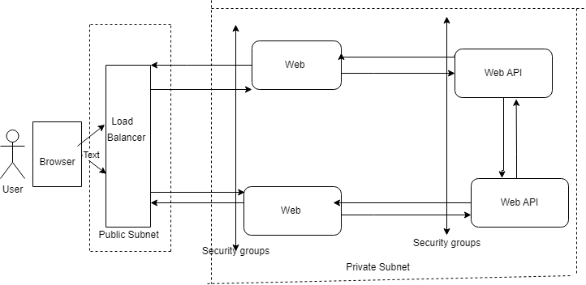

# DevOps Technical Assessments
The Terraform configuration files contained in this repository will create the following resources: 
A VPC  
A highly available load balancer  
Private and public subnets --We want to deploy our applications in the private subnet for increased secuity 
EC2 instances which can scale horizontally depending on traffic this is achieved using Autoscaling which allows the number of instances to scale up or down depending on traffic. 
The The Terraform configuration files will also create  
A Load balancer security group  
Security groups for the Ec2 instances  
A target group which allows the load balancer to route traffic to multiple instances will be created  
Adding of newly created instances to the target group will also be handled by code defined in the configuration files  
# Architecure Diagram

# Explanation of the diagram
End users are assessing the web application through their browsers. The traffic from these devices do not hit our application directly rather they go through a load balancer. The load balancer will then distribute these requests to various ec2 instances that are running our applications in the private subnet. For high availabaility I created private subnets in all the azs in the chosen region and it is in these private subnets that the ec2 instances that will run our  application will be created. For increased security both Web and API are deployed in the private subnet and I also configured the secuity group so that the instances running our applications only accept inbound traffic from the load balancer. Our Elastic Load Balancer which is highly available is in the public subnet so that It could be accesible over the internet.

